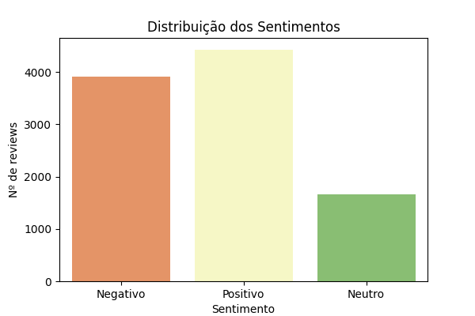
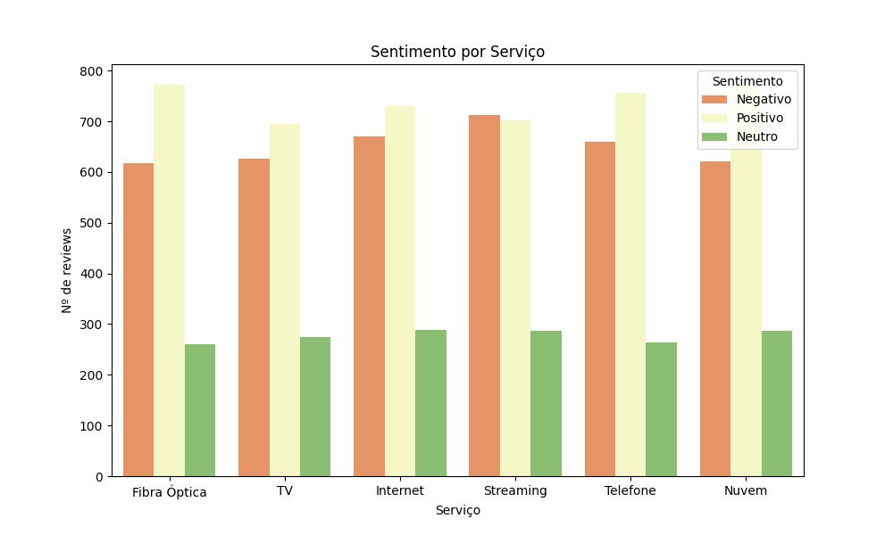
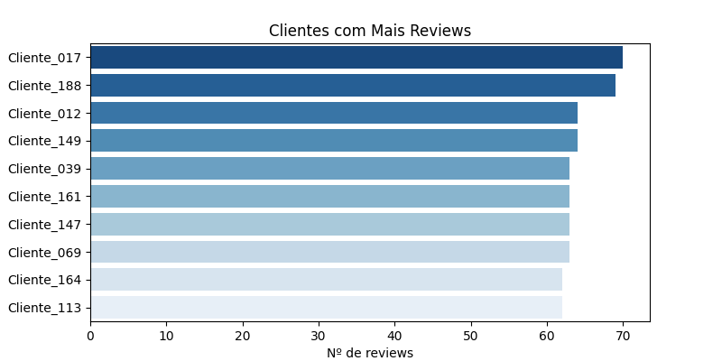
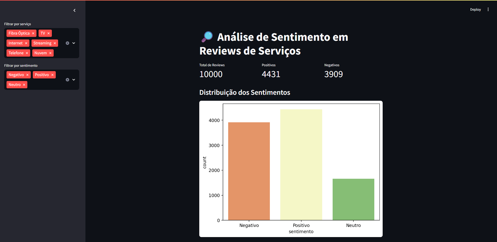
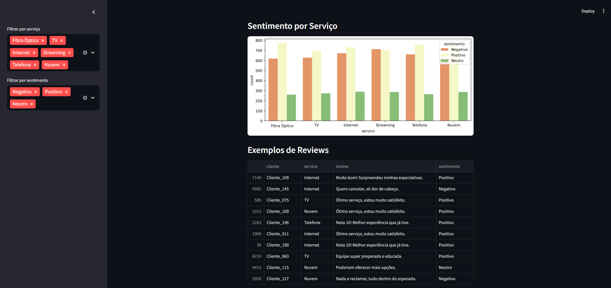
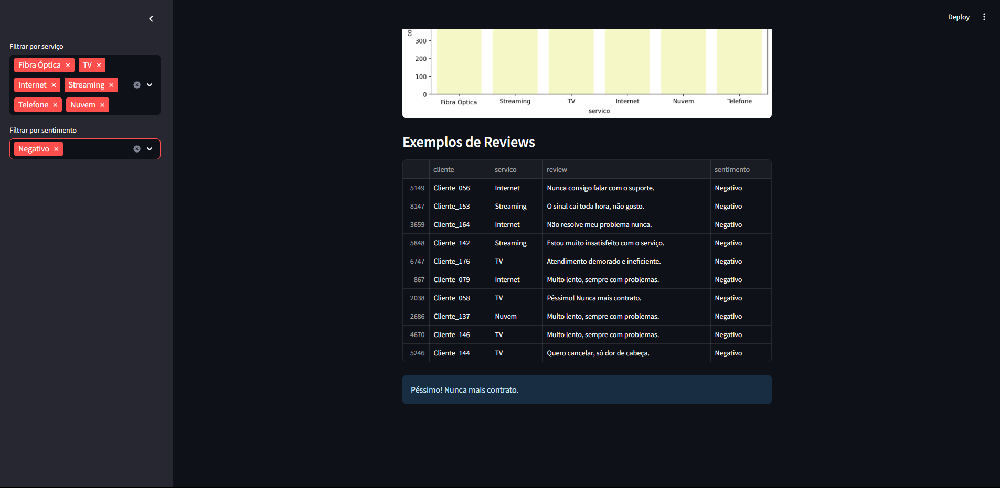
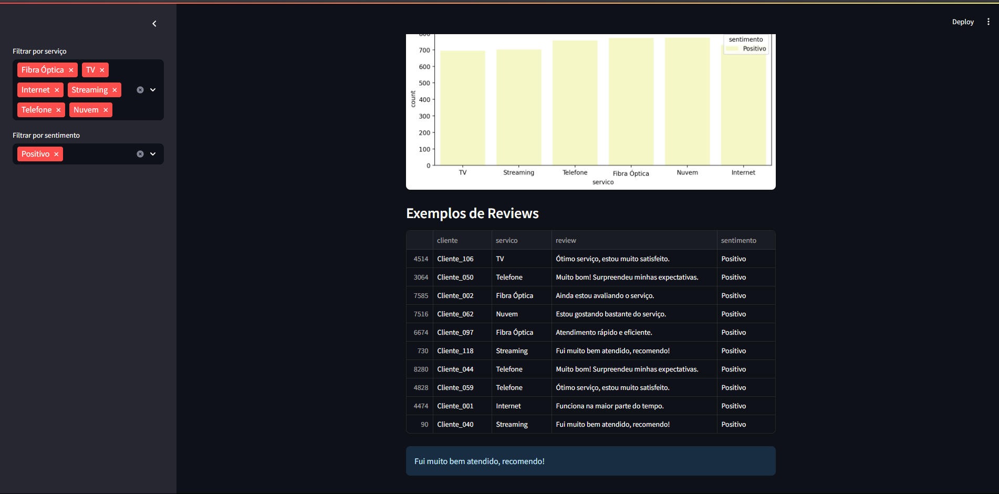

---
# 🔎 Sentiment Analysis – Análise de Sentimento em Reviews de Serviços

Este projeto simula e implementa um sistema de análise de sentimento em reviews de clientes de serviços, utilizando **Python**, **NLP com Transformers** (Hugging Face), visualização interativa e dashboard em Streamlit.

---

## ✨ Objetivo

**Compreender a percepção e a satisfação dos clientes sobre diferentes serviços por meio da análise automatizada de sentimentos em avaliações (reviews).**

---

## 🗂️ Estrutura do Projeto

```bash
sentiment-analysis/
├── data/
│   ├── reviews.csv
│   └── reviews_sentimentos.csv
├── notebooks/
│   ├── 00_gera_reviews.py
│   ├── 01_analise_sentimento.ipynb
│   └── 02_visualizacao_e_insights.ipynb
├── app/
│   └── dashboard.py
├── imgs/
│   ├── sentimento_distribuicao.png
│   ├── sentimento_por_servico.png
│   ├── top_clientes.png
│   ├── nuvem_negativo.png
│   ├── demo1.png
│   ├── demo2.png
│   ├── demo3.png
│   └── (outros prints do projeto)
├── requirements.txt
└── README.md
````

---

## 🚀 Como Rodar o Projeto

### 1. **Crie o ambiente e instale as dependências**

```bash
python -m venv venv
# Ative o ambiente virtual:
# Windows:
venv\Scripts\activate
# Linux/macOS:
source venv/bin/activate

pip install -r requirements.txt
```

### 2. **Gere ou insira o dataset de reviews**

```bash
python notebooks/00_gera_reviews.py
```

### 3. **Execute os notebooks**

* **01\_analise\_sentimento.ipynb:** Aplica o modelo Transformer para rotular os sentimentos dos reviews (positivo, neutro, negativo)
* **02\_visualizacao\_e\_insights.ipynb:** Analisa resultados, gera gráficos e identifica padrões

### 4. **Rode o dashboard**

```bash
streamlit run app/dashboard.py
```

---

## 📊 **Sobre o Dataset (`data/reviews.csv`)**

A base simula 1000 reviews de clientes, podendo ser adaptada para dados reais.

Colunas principais:

* `cliente`: identificador do cliente
* `servico`: tipo de serviço avaliado (Internet, TV, Nuvem, etc.)
* `review`: texto da avaliação escrita pelo cliente
* `sentimento`: sentimento extraído automaticamente (Positivo, Neutro, Negativo)

Após processamento, a base `reviews_sentimentos.csv` inclui as predições de sentimento.

---

## 📝 **Fluxo do Projeto**

### **1. Análise Exploratória (EDA)**

* **Distribuição dos sentimentos:**
  

  > Mostra a proporção de sentimentos positivos, neutros e negativos entre todos os reviews.

* **Sentimento por serviço:**
  

  > Compara a percepção dos clientes entre diferentes serviços oferecidos.

* **Clientes mais engajados:**
  

  > Identifica clientes que mais avaliaram serviços, útil para estratégias de relacionamento.

* **Nuvem de palavras de reviews negativos:**
  

  > Palavras mais citadas em avaliações negativas — insights diretos para melhoria dos serviços.

---

### **2. Análise de Sentimento com Transformers**

* O modelo utilizado (ex: BERT fine-tuned para português) lê cada review e classifica automaticamente o sentimento.
* Os resultados são rotulados e agregados para análises posteriores.

---

### **3. Dashboard Interativo**

O dashboard permite:

* Visualizar estatísticas gerais de sentimentos
* Filtrar reviews por serviço e tipo de sentimento
* Consultar exemplos reais de avaliações
* Explorar tendências dos clientes em tempo real

#### Exemplos de tela do dashboard:






---

## 💡 **Principais Insights**

* Serviços com mais avaliações negativas podem demandar ações rápidas de melhoria.
* Palavras recorrentes em reviews negativos indicam problemas específicos.
* Acompanhamento de sentimento ao longo do tempo pode detectar crises ou oportunidades de divulgação.

---

## 🔬 **Expansões Possíveis**

* Aplicar o projeto em dados reais de sites/rede sociais
* Adicionar análise temporal (sentimento mês a mês)
* Implementar classificação multilíngue ou multi-label
* Integrar com painéis executivos ou CRMs
* Geração de relatórios automáticos para áreas de negócio

---

## 👤 **Autor**

Desenvolvido por [Luiz Nelson](https://github.com/luizznelson)